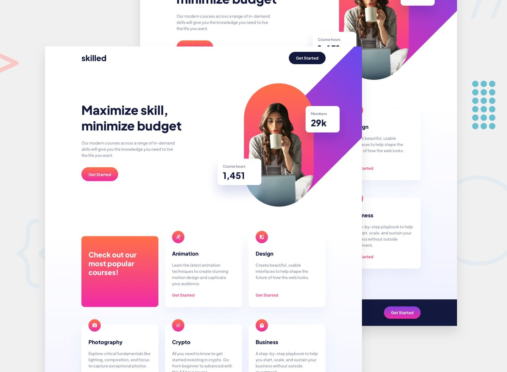

# Frontend Mentor - Skilled e-learning landing page solution

This is a solution to the [Skilled e-learning landing page challenge on Frontend Mentor](https://www.frontendmentor.io/challenges/skilled-elearning-landing-page-S1ObDrZ8q). Frontend Mentor challenges help you improve your coding skills by building realistic projects.

## Table of contents

- [Overview](#overview)
  - [The challenge](#the-challenge)
  - [Screenshot](#screenshot)
  - [Links](#links)
  - [Built with](#built-with)
  - [What I learned](#what-i-learned)
  - [Continued development](#continued-development)
  - [Author](#author)

## Overview

### The challenge

Users should be able to:

- View the optimal layout depending on their device's screen size
- See hover states for interactive elements

### Screenshot

### Links
- Live Site URL: [Add live site URL here](https://your-live-site-url.com)

### Built with

- Semantic HTML5 markup
- CSS custom properties
- Flexbox
- Mobile-first workflow

### What I learned

In this project I learnt about working with a mobile first workflow and using media queries to allow for a responsive landing page on mobile, tablet and desktop. I also developed my understanding of CSS grid and flexbox to manipulate elements on the page.

### Continued development

I still need to continue to develop a more efficient mobile first workflow, as well an an understanding of margin and padding to avoid elements moving around the page and causing unintentional behaviours.

## Author
- Github - [achiewe](https://github.com/achiewe)
- LinkedIn - [achi mamukashvili](https://www.linkedin.com/in/achi-mamukashvili-721928263/)

